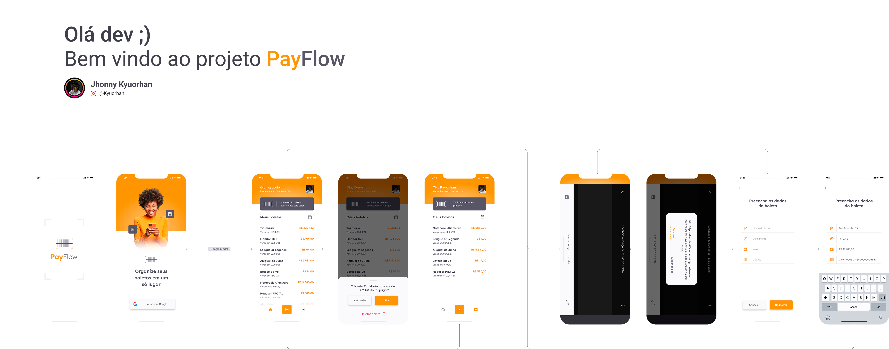

# PayFlow

<div align="center">
  
  
  <p align="center">
    <strong>Aplicativo mobile para gerenciamento inteligente de boletos</strong><br>
    Desenvolvido com React Native + Expo
  </p>

  <div align="center">
    
    
    
    
  </div>
  
  <br>
  
  <div align="center">
    <a href="https://github.com/Kyuorhan/payflow/actions">
      
    </a>
    <a href="https://www.figma.com/community/file/1352388163173966368/payflow">
      
    </a>
    <a href="#license">
      
    </a>
  </div>
</div>

---

## Sobre o Projeto

O **PayFlow** é um aplicativo mobile desenvolvido para facilitar o gerenciamento de boletos. Com uma interface moderna e intuitiva, o app permite organizar, escanear e controlar todos os seus boletos em um só lugar.

<div align="center">

| Funcionalidade          | Descrição                                  |
| ----------------------- | ------------------------------------------ |
| **Scanner de Código**   | Escaneie códigos de barras automaticamente |
| **Autenticação Google** | Login rápido e seguro                      |
| **Dashboard Intuitivo** | Visão geral de todos os boletos            |
| **Organização Smart**   | Categorize e filtre seus boletos           |

</div>

## Tecnologias

<div align="center">
  <table>
    <tr>
      <td align="center" width="100">
        <br>
        <sub><b>React Native</b></sub>
      </td>
      <td align="center" width="100">
        <br>
        <sub><b>TypeScript</b></sub>
      </td>
      <td align="center" width="100">
        <br>
        <sub><b>Expo SDK 50</b></sub>
      </td>
      <td align="center" width="100">
        <br>
        <sub><b>Figma Design</b></sub>
      </td>
    </tr>
  </table>
</div>

**Stack Principal:**

- Framework: React Native com Expo SDK 50
- Linguagem: TypeScript para tipagem robusta
- Navegação: Expo Router (file-based routing)
- Build: EAS Build para iOS e Android
- Design: Figma para prototipação e design system

## Início Rápido

### Pré-requisitos

```bash
node >= 18.0.0
npm >= 9.0.0
```

### Instalação

```bash
# Clone o repositório
git clone https://github.com/Kyuorhan/payflow.git
cd payflow

# Instale as dependências
npm install

# Inicie o desenvolvimento
npm start
```

### Executar no dispositivo

```bash
# iOS (requer macOS + Xcode)
npm run ios

# Android (requer Android Studio)
npm run android
```

## Screenshots & Demo

<div align="center">
  
  
  <br><br>
  
  <div align="center">
    
    <strong>Demonstração Interativa</strong>
  </div>
  
  <p>
    <a href="https://www.figma.com/proto/1352388163173966368/payflow" target="_blank">
      
    </a>
  </p>
  
  <p><em>Navegue pelas telas, interaja com os componentes e experimente a UX completa</em></p>
</div>

## Build para Produção

```bash
# Build iOS
npx eas build --platform ios --profile production

# Build Android  
npx eas build --platform android --profile production

# Build para ambas plataformas
npx eas build --platform all
```

### CI/CD Automático
- GitHub Actions configurado para builds automáticos
- EAS Build para iOS e Android
- Testes automatizados em cada push

## Estrutura do Projeto

```
payflow/
├── app/                    # Rotas (Expo Router)
│   ├── _layout.tsx         # Layout principal
│   ├── index.tsx           # Splash screen
│   ├── login.tsx           # Autenticação
│   └── (tabs)/             # Navegação principal
│       ├── home.tsx        # Lista de boletos
│       ├── scanner.tsx     # Scanner de código
│       └── profile.tsx     # Perfil do usuário
├── src/
│   ├── components/         # Componentes reutilizáveis
│   │   ├── ui/             # Componentes de UI base
│   │   └── shared/         # Componentes compartilhados
│   ├── constants/          # Constantes (cores, fonts, etc)
│   ├── hooks/              # Custom hooks
│   ├── services/           # Serviços (API, auth)
│   ├── types/              # Tipos TypeScript
│   └── utils/              # Funções utilitárias
├── assets/                 # Recursos estáticos
└── docs/                   # Documentação
```

## Migração Flutter → React Native

<div align="center">
  
  <br>
  <strong>Evolução Tecnológica</strong>
</div>

Este projeto foi **originalmente desenvolvido em Flutter & Dart** e posteriormente migrado para **React Native** para aproveitar um ecossistema mais amplo e ferramentas modernas de desenvolvimento.

### Por que React Native?

<table align="center">
  <tr>
    <th>Aspecto</th>
    <th>Benefício</th>
  </tr>
  <tr>
    <td>Ecossistema</td>
    <td>Maior comunidade e bibliotecas disponíveis</td>
  </tr>
  <tr>
    <td>Desenvolvimento</td>
    <td>Expo SDK acelera o desenvolvimento</td>
  </tr>
  <tr>
    <td>Manutenção</td>
    <td>Stack JavaScript mais familiar para a equipe</td>
  </tr>
  <tr>
    <td>Deploy</td>
    <td>EAS Build simplifica o processo de build</td>
  </tr>
</table>

> **Código Flutter preservado na branch:** [`flutter-legacy`](https://github.com/Kyuorhan/payflow/tree/flutter-legacy)

## Design & Figma

<div align="center">
  
  <br>
  <strong>Design System & Prototipação</strong>
</div>

O PayFlow segue um design system completo criado no Figma, disponível como projeto da comunidade.

### Navegação Interativa no Figma

<div align="center">
  <a href="https://www.figma.com/proto/1352388163173966368/payflow" target="_blank">
    
  </a>
  
  <br><br>
  
  <p>Experimente a navegação completa:</p>
  
  <table>
    <tr>
      <td>🖱️ <strong>Navegação por Cliques</strong></td>
      <td>Clique nos hotspots para navegar</td>
    </tr>
    <tr>
      <td>🔍 <strong>Zoom e Pan</strong></td>
      <td>Explore os detalhes do design</td>
    </tr>
    <tr>
      <td>📱 <strong>Preview Responsivo</strong></td>
      <td>Teste em diferentes dispositivos</td>
    </tr>
    <tr>
      <td>🎮 <strong>Interações</strong></td>
      <td>Botões e formulários funcionais</td>
    </tr>
  </table>
</div>

### Links Figma

- [📁 Arquivo da Comunidade](https://www.figma.com/community/file/1352388163173966368/payflow)
- [🎯 Protótipo Interativo](https://www.figma.com/proto/1352388163173966368/payflow)
- [📐 Design System](https://www.figma.com/file/1352388163173966368/payflow)

**Documentação completa:** [Integração com Figma](./docs/figma-integration.md)

## 🧪 Testes

```bash
# Executar todos os testes
npm test

# Testes em modo watch
npm run test:watch

# Cobertura de testes
npm run test:coverage

# Lint do código
npm run lint
```

## Contribuição

Contribuições são bem-vindas! Para contribuir:

1. Faça um fork do projeto
2. Crie sua feature branch (`git checkout -b feature/NovaFuncionalidade`)
3. Commit suas mudanças (`git commit -m 'Adiciona nova funcionalidade'`)
4. Push para a branch (`git push origin feature/NovaFuncionalidade`)
5. Abra um Pull Request

## 📄 Licença

Este projeto está licenciado sob a **MIT License** - veja o arquivo [LICENSE](LICENSE) para detalhes.

## 👨‍💻 Autor

<div align="center">
  
  
  **Noah Entregas**
  
  [](https://github.com/Kyuorhan)
  [](https://linkedin.com/in/noah-entregas)
</div>

---

<div align="center">
  <p>⭐ Se este projeto te ajudou, considere dar uma estrela!</p>
  <p>Feito com ❤️ e ☕ por <strong>Jhonny Kyuorhan</strong></p>
</div>

<p align="center">O Layout foi desenvolvido por <a href="https://www.instagram.com/kyuorhan">Jhonny Kyuorhan</a>, e você pode acessá-lo no Figma:</p>

<br>

<p> 
    
  >- [Mobile](https://www.figma.com/community/file/1352388163173966368/payflow) 📱
</p>

<br>

### <h3 align="center">Como Usar 🤔</h3>

##

###

Clone esse repositório:

```
$ git clone https://github.com/Kyuorhan/payflow
```

Entre no diretório:

```
$ cd meals
```

Instale as dependências:

```
$ flutter pub get
```

Execute a aplicação:

```
$ flutter run
```

###

<div align="center">
  <p></p>

<br> <br>
Este projeto foi desenvolvido com ❤️ e está em constante evolução, buscando sempre novos desafios.<br>
**[Sinta-se à vontade para participar e trocar ideias no GitHub! 👋](https://github.com/Kyuorhan)**.

##

###

  <div align="center" > 
    <a href="https://www.linkedin.com/in/jhonny-kyuorhan/" target="_blank"> </a> 
    <a href = "mailto:jkdevprogrammer@gmail.com"></a>
    <a href="https://www.twitch.tv/kyuorhan" target="_blank"> </a> 
    <a href="https://www.instagram.com/kyuorhan" target="_blank"> </a>
    <!-- <a href="https://steamcommunity.com/id/Kyuorhan/" target="_blank"> </a> -->  
  </div>   
</div>
