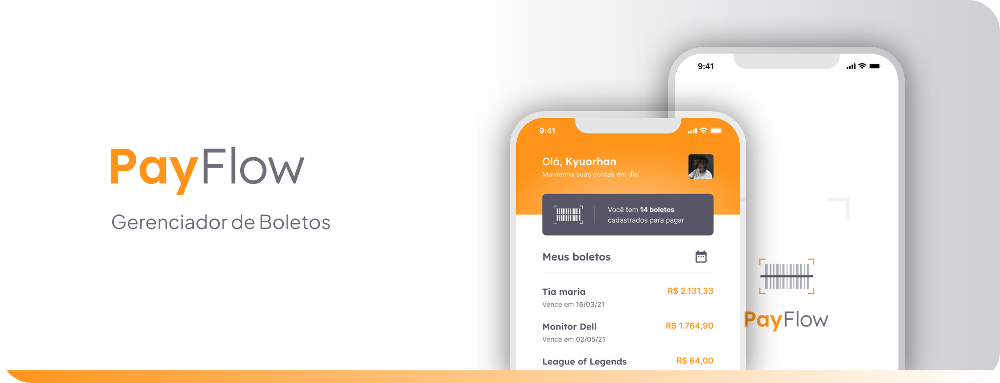

<p align="center">
  
</p>

###

<p align="center">
    
         
    
</p>

<br>

### <h3 align="center">Tópicos 📋</h3>
##

<br>

<p> 

  >- [Sobre](#sobre-) 📖
  >- [Layout](#layout-) 🎨
  >- [Como Usar](#como-usar-) 🤔    
</p>

###

### <h3 align="center">Sobre 📖</h3>
##

###

O projeto **PayFlow** foi desenvolvido de um propósito de espalhar conhecimento na tecnologia. Além da intensa rotina de estudos, planejamentos, muitas conexões e networking, interagindo com varias comunidades.

###

>- O **PayFlow** é um projeto elaborado e bem pensado para facilitar o Gerenciamento de Boletos, assim como **consultas**, ler o **Código de Barra** e gerenciar todos os boletos em um só lugar.<br>

###

> - O **PayFlow** se trata de um app mobile feito em **Flutter & Dart** para Gerenciamento de Boletos, contendo recursos como o uso de **câmera e galeria**, **Machine Leaning com MLKit**, **Firebase Core e SignIn**, **Animações e Estilizações Personalizadas**, entre vários outros pontos, como o uso do **SharedPreferences**. <br>

###

### <h3 align="center">Layout 🎨</h3>
##

<p align="center">
  
</p>

<p align="center">O Layout foi desenvolvido por <a href="https://www.instagram.com/kyuorhan">Jhonny Kyuorhan</a>, e você pode acessá-lo no Figma:</p>

<br>

<p> 
    
  >- [Mobile](https://www.figma.com/community/file/1352388163173966368/payflow) 📱
</p>

<br>

### <h3 align="center">Como Usar 🤔</h3>
##

###

Clone esse repositório:
``` 
$ git clone https://github.com/Kyuorhan/payflow
```    
Entre no diretório:
``` 
$ cd meals
```    
Instale as dependências:
``` 
$ flutter pub get
```  
Execute a aplicação: 
``` 
$ flutter run
```

###

<div align="center">
  <p></p>

  <br>  <br>
  Este projeto foi desenvolvido com ❤️ e está em constante evolução, buscando sempre novos desafios.<br>
  **[Sinta-se à vontade para participar e trocar ideias no GitHub! 👋](https://github.com/Kyuorhan)**.
 
  ##

  ###
  <div align="center" > 
    <a href="https://www.linkedin.com/in/jhonny-kyuorhan/" target="_blank"> </a> 
    <a href = "mailto:jkdevprogrammer@gmail.com"></a>
    <a href="https://www.twitch.tv/kyuorhan" target="_blank"> </a> 
    <a href="https://www.instagram.com/kyuorhan" target="_blank"> </a>
    <!-- <a href="https://steamcommunity.com/id/Kyuorhan/" target="_blank"> </a> -->  
  </div>   
</div>
